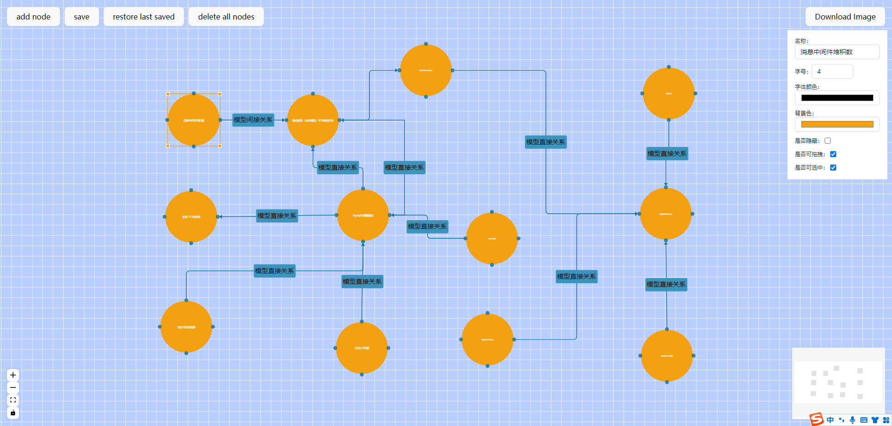
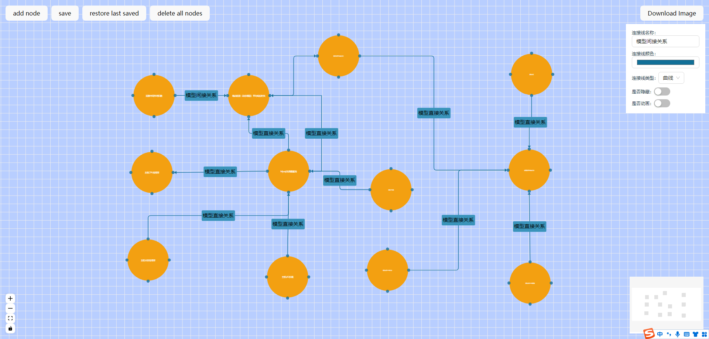

<!--
 * @Description:
 * @Version:
 * @Author: ji.yaning
 * @Date: 2023-10-23 16:54:46
 * @LastEditors: ji.yaning
 * @LastEditTime: 2024-02-06 14:30:28
-->
# React Flow Demo

[React Flow 官方文档](https://reactflow.dev/)

## 开发构建

### 快速开始

克隆项目：

```bash
https://github.com/jiyaning/my-react-flow-app.git
```

 进入目录安装依赖：

 ```bash
npm i
 ```

 开发：

```bash
npm run dev
```

## 效果展示

选中node节点：



选中edge线条：

